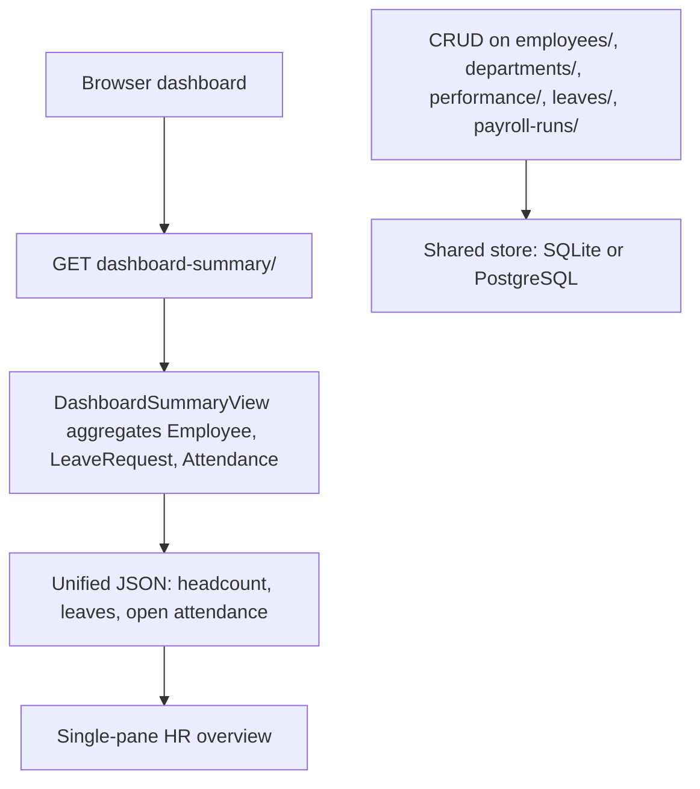
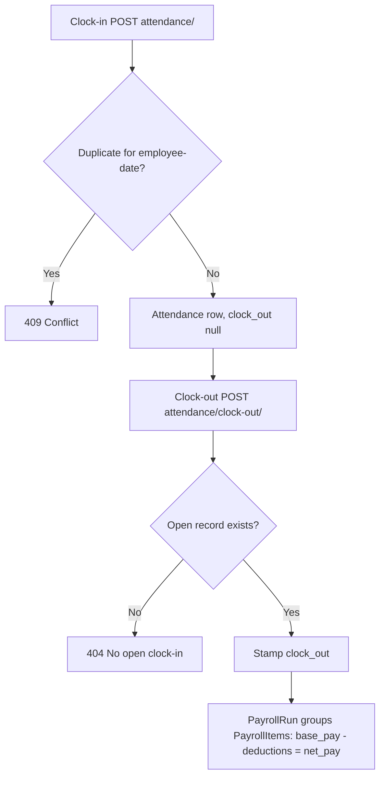
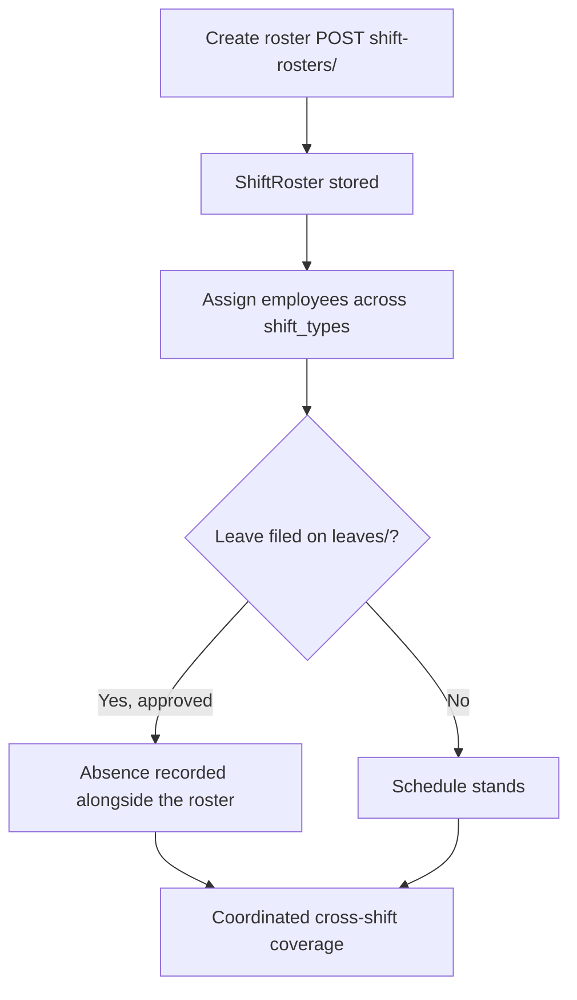
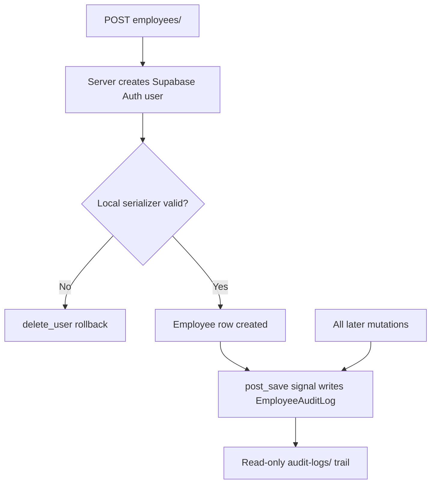
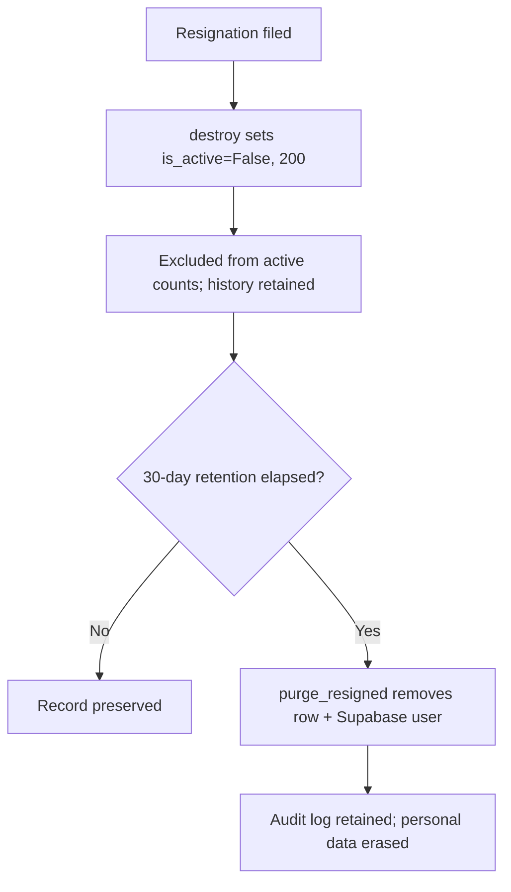

# CHAPTER 3

## METHODOLOGY

### 3.1 Research Design

The developers adopted a Waterfall model modified through sprint-based task division. The sequential Waterfall structure — requirements analysis, system design, implementation, testing, deployment, and maintenance — was retained because the problem domain was fixed at the outset: the five Statements of the Problem define a bounded set of HR modules (records, attendance, payroll, scheduling, security, offboarding), and the deliverable is graded documentation whose chapters presume completed prior phases. Pure Agile was rejected because its emergent-requirements assumption does not fit a capstone with pre-approved SOPs; pure Waterfall was judged too rigid for a multi-member team working in parallel.

Sprint-based task division supplied the missing parallelism. Within each Waterfall phase, work was partitioned into short iterations with assigned module owners: one sprint team each for (a) employee/department records and dashboard, (b) attendance and leave, (c) shift roster, (d) payroll, and (e) authentication, audit logging, and offboarding. Each sprint ended with an integration checkpoint — `migrate`, endpoint smoke tests against `api/urls.py`, and merge to the shared branch — so interface mismatches (e.g., serializer field names, UUID primary keys) surfaced within the phase rather than at deployment. This hybrid preserves Waterfall's phase-gate discipline for the manuscript while giving the team Agile-style concurrency during construction.

**Figure 7 — Development Process Model.** See `docs/chapter3/figures/figure7-process-model.html`. The drawing reads left to right: the five Waterfall phases in order, with the sprint teams stacked inside each phase because they worked in parallel, not in sequence. The diamonds between phases are integration checkpoints — migrate, endpoint smoke tests, merge to the shared branch — and the point of the whole shape is that interface mismatches (serializer field names, UUID primary keys) were caught inside the phase instead of at deployment.

**Figure 8 — Testing and Deployment Pipeline.** See `docs/chapter3/figures/figure8-tdd-pipeline.html`. Every task followed the same loop: write the failing test first and watch it go red, implement the smallest change that turns it green, then run the full suite (47 tests) plus the format checks (black, isort, `manage.py check`) before committing. One conventional commit (`fix:` / `feat:`) per task kept the history readable; pushes went to the feature branch and reached `main` only through a reviewed pull request, with the live endpoint matrix re-verified before merge.

The study proceeded through five phases. First, requirements analysis translated each SOP into a module contract (models, endpoints, validations). Second, system design produced the decoupled web architecture (Section 3.2) and the relational schema. Third, implementation built the Django 6.1 + DRF backend in `core/` (models, serializers, views, signals) with Supabase Auth handled strictly server-side. Fourth, testing verified CRUD endpoints, duplicate clock-in rejection, clock-out matching, and the auth-create/rollback path. Fifth, deployment and documentation packaged the system with the figures and tables below.

### 3.2 System Architecture

**Figure 1 — System Architecture.** See `docs/chapter3/figures/figure1-architecture.html`. The system has four main parts. First, the browser — this is what the user sees and clicks on: the dashboard, the inbox, and the forms. It does not make any decisions on its own; it just sends requests to the server. Before it can do anything except view the dashboard numbers, the user must sign in through `api/session-login/` (separate scripts and operators can use an API token from `api/auth-token/` instead). Second, the Django server (Django 6.1 + Django REST Framework) — this is where all the real work happens. It checks every input, applies the company rules, and sends back the answers through REST endpoints in `api/urls.py`: `employees/`, `attendance/` (plus `attendance/clock-out/`), `leaves/`, `shift-rosters/`, `payroll-runs/`, `payroll-items/`, `performance/`, `departments/`, `audit-logs/`, `dashboard-summary/`, and the newer `messages/` and `claim-statuses/`. Two examples of these rules: the same employee cannot clock in twice on the same day, and adding an employee with an email that already exists is rejected with a 409 conflict response. Every endpoint except the dashboard summary requires a login, list results come 10 per page, and all errors arrive in one uniform shape (`{"error": "..."}`). Third, the database — this is where all the records are saved. On a plain school setup it is SQLite (`db.sqlite3`, no installation needed), but when the `DB_HOST` setting is given the same code switches to PostgreSQL (for example, the Supabase-hosted database the team uses), as declared in `kumon_ems/settings.py`. Fourth, Supabase Auth — an outside service that handles user accounts and passwords through the server-side client in `core/supabase_client.py`, so no password ever passes through the browser.

As an example, when a new employee is added, the browser sends the details to Django. Django first creates the account in Supabase, and only if that succeeds does it save the employee record in the database. If the database save fails, Django deletes the Supabase account again so nothing is left half-done. In the same way, every operation follows this pattern: the browser asks, Django decides and checks, and then the result is saved. This separation keeps the system organized and easier to maintain (Kumar et al., 2025).

**Figure 2 — Entity-Relationship Diagram.** See `docs/chapter3/figures/figure2-erd.html`. The database has twelve tables (`core/models.py`). Eleven of them use UUIDs as their IDs; only `ClaimStatus` is different, using a text `claim_id` instead. The tables fall into five groups. First, the *organization group*: `Department` and `Employee`. An employee belongs to a department, and a department can also point to one employee as its manager — if that manager is deleted, the slot just becomes empty instead of breaking (`SET_NULL`). Second, the *time group*: `Attendance`, `LeaveRequest`, and `ShiftRoster`. Attendance does not allow two records for the same employee on the same day, leaves start at `Pending`, and each roster row now belongs to one employee on one work date. Third, the *pay group*: `PayrollRun` holds the pay period, `PayrollItem` holds one employee's numbers (the server computes `net_pay` itself from `base_pay` minus deductions), and `ExpenseClaim` holds reimbursement requests. Fourth, the *oversight group*: `PerformanceReview` for evaluations and `EmployeeAuditLog`, which keeps its rows even after the employee is gone. Fifth, the *messaging group*: `Message` (sorted by time) and `ClaimStatus` (found by `claim_id`) — these two stand alone with no links to the other tables. Tables that exist in the database but have no working feature yet carry an amber UNDER DEVELOPMENT tag in the diagram — right now that is only `ExpenseClaim`: its code exists in `core/views.py`, but there is no URL route for it yet, so it cannot be reached through the API.

**Figures 3–6 — Supporting diagrams.** Four views the architecture and ERD cannot show on their own. Figure 3 (`figure3-dfd-context.html`) is the Level-0 data flow: one bubble for the whole system, with HR Admin, Employee, and Supabase Auth outside it — it answers *who* exchanges data with the system. Figure 4 (`figure4-seq-onboarding.html`) traces one onboarding call step by step, including the `delete_user` rollback that prevents orphan accounts. Figure 5 (`figure5-activity-attendance-payroll.html`) follows SOP 2 across three swimlanes, showing both failure branches (409 duplicate, 404 no open record) and the stored `net_pay` at the end. Figure 6 (`figure6-state-leave.html`) shows the only three states a leave request can be in and what moves it between them.

### 3.3 Minimum System Requirements

All requirements below apply to both developer and end-user machines; the stack is lightweight enough that no separate build-server class is needed.

**Table 1 — Minimum Hardware Requirements (Developer and User)**

| Category | Minimum Requirement |
|---|---|
| Processor (CPU) | Dual-core 64-bit, 2.0 GHz or equivalent |
| Memory (RAM) | 4 GB |
| Storage | 2 GB free disk space (project, `.venv`, database file) |
| Network | Broadband connection (required for Supabase Auth calls) |
| Display | 1280 × 720 or higher |

The figures derive from the runtime profile: Django's development server and SQLite impose no meaningful CPU burden, 4 GB accommodates Python 3.14 plus a Chromium tab for the client, and Supabase Auth is network-mandatory — offline operation is unsupported since employee creation calls `supabase.auth.admin.create_user`.

**Table 2 — Minimum Software Requirements (Developer and User)**

| Category | Minimum Requirement |
|---|---|
| Operating System | Windows 10/11, Linux, or macOS (any Python 3.14-capable OS) |
| Language / Framework | Python 3.14; Django 6.1; DRF 3.18.0 (`requirements.txt`) |
| Environment | Project `.venv` with `supabase==2.31.0`, `django-cors-headers==4.9.0`, `python-dotenv==1.2.3`, `psycopg2-binary==2.9.13` (needed only for the PostgreSQL path) |
| Database | SQLite (`db.sqlite3`, local default) or PostgreSQL when `DB_HOST` is set (Supabase-hosted); Supabase project URL + service-role key in `.env` |
| Browser (user) | Current Chrome, Edge, or Firefox with JavaScript enabled |
| Tooling (developer) | VS Code or equivalent; Git; `.env` configured per `core/supabase_client.py` |

### 3.4 Methods and Tools (Per S.O.P.)

This section states, for each SOP, how it was resolved in code, with the controlling models, endpoints, and logic.

#### 3.4.1 SOP 1: Centralized data system for attendance, salary, performance, and paid leaves

Resolved through a single relational store (`Employee`, `Department`, `PerformanceReview`, `LeaveRequest`, `PayrollRun`/`PayrollItem` in `core/models.py`) exposed uniformly under `api/urls.py`, with cross-module aggregates served by `DashboardSummaryView` (`dashboard-summary/`), which counts total/active employees, approved/pending leaves, and open attendance records in one response.

The flowchart shows centralization in two moves: detail endpoints keep one source of truth per module, while the summary endpoint joins them into a single dashboard payload, eliminating the fragmented record-keeping cited in the problem statement. On the screen, six regions are live against the API (the KPI summary, the employee directory, onboarding, leave filing, the message inbox, and claim statuses); the remaining views (attendance, shifts, payroll, audit) still show static demo content, marked by a LIVE / DEMO DATA badge.

#### 3.4.2 SOP 2: Attendance tracking and payroll calculation

Resolved at three levels. The schema enforces `unique_together (employee, date)` on `Attendance`; `AttendanceSerializer.validate` rejects a second clock-in per employee-day, and a lost race on the same record resolves to 409; and `AttendanceClockOutView` (`attendance/clock-out/`) closes only the single open record (`clock_out__isnull=True`), returning 404 when none exists. Malformed input (for example a clock-out with no usable time value) fails fast with 400, while a well-formed request that conflicts with current state returns 409. Payroll is computed into `PayrollItem` (`base_pay`, `deductions`, `net_pay`) grouped under a `PayrollRun` period, so figures are stored results rather than recomputed display values.

The flowchart shows the layered approach: duplicates are blocked at both the database and serializer layers, clock-out binds strictly to its matching clock-in, and payroll persists its arithmetic per period for auditability.

#### 3.4.3 SOP 3: Efficient coordination across varying shifts

Resolved through the `ShiftRoster` model (`shift_type`, `start_time`, `end_time`, `break_mins`, plus the assigned `employee` on a `work_date`) with full CRUD at `shift-rosters/` and `shift-rosters/<uuid:pk>/`, next to the leave pipeline (`leaves/`, `LeaveRequestDetailView` for approval status transitions), so scheduling and approved absences are visible in one system. The link is manual side-by-side use, not an automatic one: filing a leave does not move or flag any roster row. A shift-overlap guard rejects double-booking the same employee on the same date. Notifications (for example, telling a coordinator that a leave affects their roster) do not exist yet — no model, endpoint, or client code sends them.

The flowchart shows the coordination loop: rosters define coverage, leave requests signal gaps, and approved absences sit next to the roster in the same system so coordinators can see coverage gaps without leaving the platform.

#### 3.4.4 SOP 4: Data safety and privacy

Resolved by keeping Supabase strictly server-side: `core/supabase_client.py` builds the client from `.env` service-role credentials, `EmployeeListCreateView.post` creates the Auth user before the local `Employee` row and rolls it back via `supabase.auth.admin.delete_user` on failure, and the browser never handles secrets. Every mutation is traceable through `EmployeeAuditLog` plus `post_save`/`pre_save` receivers in `core/signals.py` (employee, department, attendance clock-in/out, leave status transitions), with a read-only `audit-logs/` endpoint for review.

The flowchart shows defense in depth: identity failures cannot leave orphan accounts, secrets never reach the client, and the signal-driven log gives a reviewable history of who changed what (a plain database table, not a tamper-proof ledger).

#### 3.4.5 SOP 5: Resignation management with 30-day retention and automated deletion

Resolved through soft-deactivation plus a retention policy. Resignation calls `EmployeeDetailView.destroy` on `employees/<uuid:pk>/`, which sets `Employee.is_active=False` and returns 200 with the deactivation summary — the row is soft-deactivated, never hard-deleted by this call. Deactivation immediately removes the employee from `DashboardSummaryView` active counts while preserving `Attendance`, `PayrollItem`, and `PerformanceReview` rows and the `EmployeeAuditLog` history (`SET_NULL` keeps log entries after hard delete). Permanent erasure executes after the 30-day retention window via the `purge_resigned` management command (`python manage.py purge_resigned --dry-run` previews; `--days` sets the window), which removes the local row together with its Supabase user per Ussher-Eke (2025); the window itself is enforced as an unscheduled operational policy (a weekly cron or Task Scheduler entry at the operator's discretion) rather than an in-code scheduler.

The flowchart shows the two-stage offboarding: immediate deactivation protects operations on day one, and deletion after the retention window satisfies privacy without destroying the audit trail prematurely.
