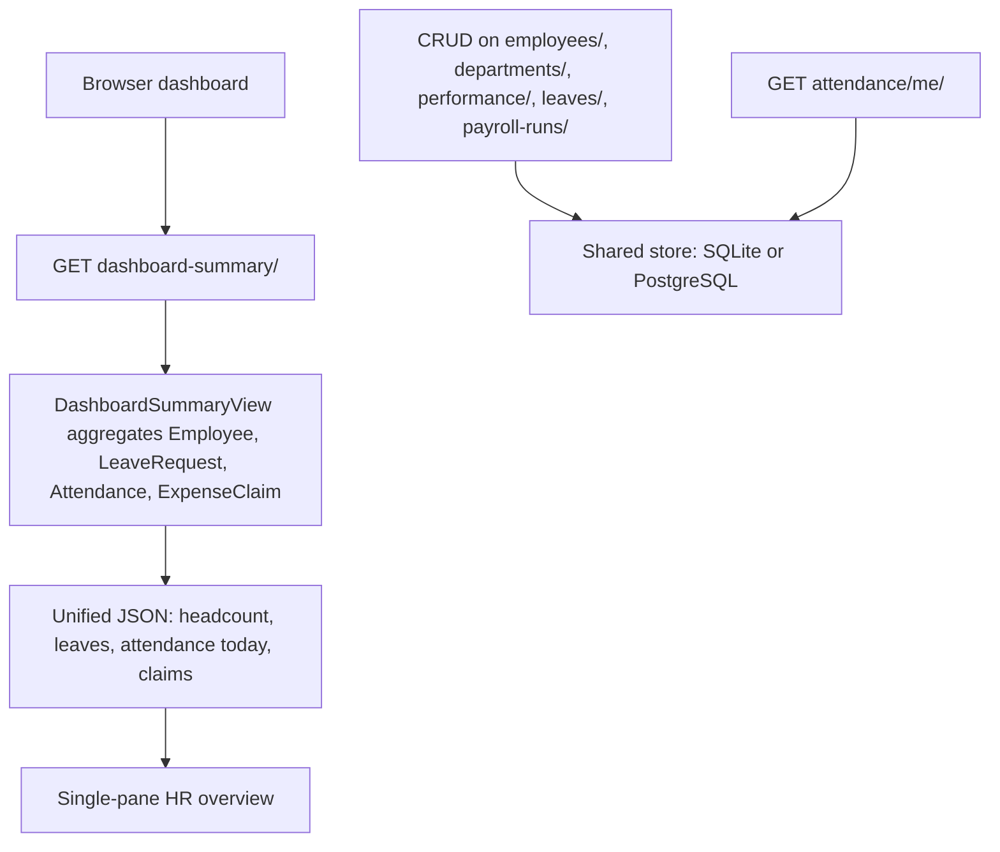
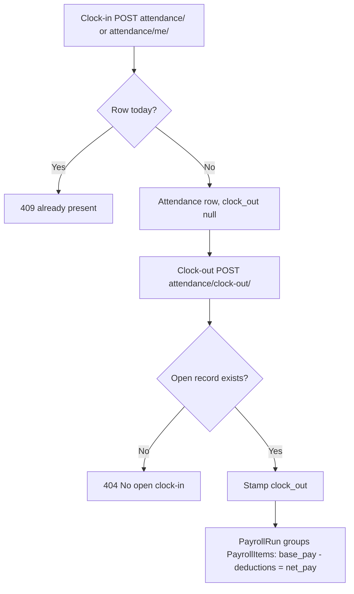
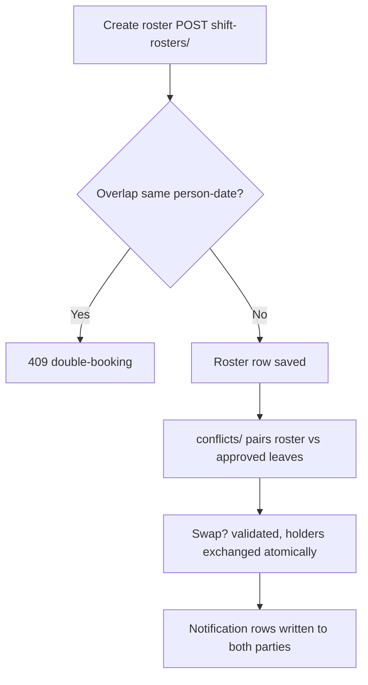
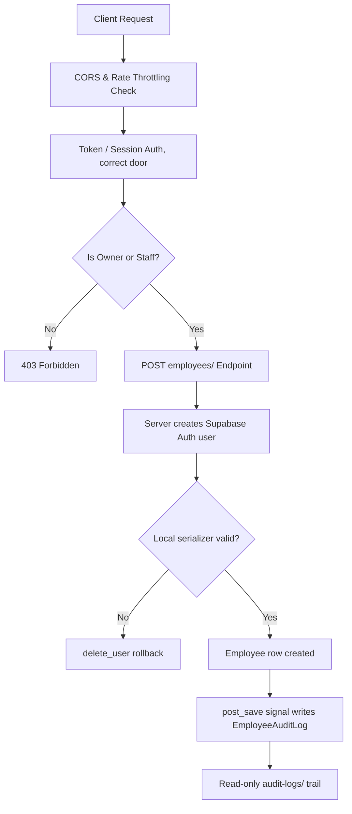
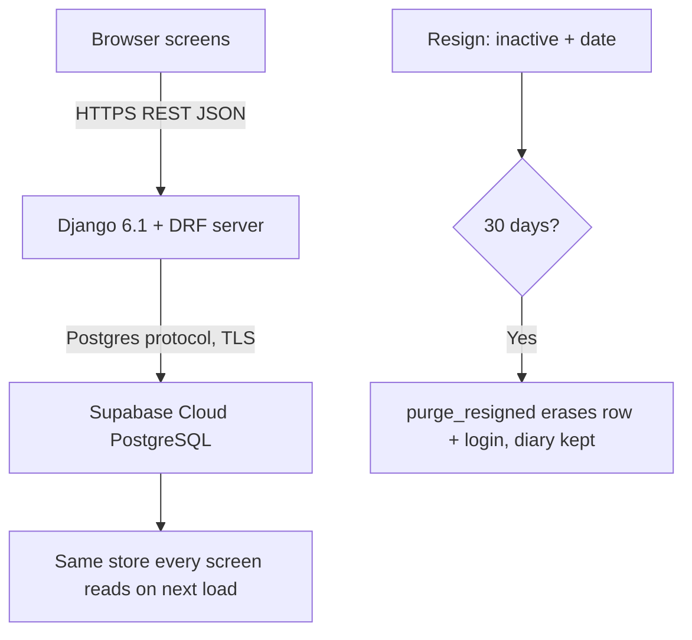

# CHAPTER 3

## METHODOLOGY

Source: `kc4el/kumon-ems-` branch `main`, HEAD `0e341c9` (pulled 2026-09-16). All claims below were read from live code on this branch: `core/models.py` (19 models), `core/views_docs.py` (2 more: `OnboardingDocument`, `SalaryAdvance`), `api/urls.py` (50 routes), `core/views.py`, `core/serializers.py`, `core/signals.py`, `core/management/commands/purge_resigned.py`, `core/supabase_client.py`, `requirements.txt`, `Latest.dbml` + `docs/erd.png` (generated ERD, 09-15-2026). Full suite on this branch: 257 tests, 8 failing — flagged honestly where they touch SOP claims (see end).

### 3.1 Research Design

The developers adopted a Waterfall model modified through sprint-based task division. The sequential Waterfall structure — requirements analysis, system design, implementation, testing, deployment, and maintenance — was retained because the problem domain was fixed at the outset: the five Statements of the Problem define a bounded set of HR modules (records, attendance, payroll, scheduling, security, scalable cloud infrastructure), and the deliverable is graded documentation whose chapters presume completed prior phases. Pure Agile was rejected because its emergent-requirements assumption does not fit a capstone with pre-approved SOPs; pure Waterfall was judged too rigid for a multi-member team working in parallel.

Sprint-based task division supplied the missing parallelism. Within each Waterfall phase, work was partitioned into short iterations with assigned module owners: one sprint team each for (a) employee/department records and dashboard, (b) attendance and leave, (c) shift roster, (d) payroll, and (e) security, audit logging, and scalable cloud infrastructure. Each sprint ended with an integration checkpoint — `migrate`, endpoint smoke tests against `api/urls.py`, and merge to the shared branch — so interface mismatches (e.g., serializer field names, UUID primary keys) surfaced within the phase rather than at deployment. This hybrid preserves Waterfall's phase-gate discipline for the manuscript while giving the team Agile-style concurrency during construction.

**Figure 7 — Development Process Model.** See `docs/chapter3/figures/figure7-process-model.html`. The drawing reads left to right: the five Waterfall phases in order, with the sprint teams stacked inside each phase because they worked in parallel, not in sequence. The diamonds between phases are integration checkpoints — migrate, endpoint smoke tests, merge to the shared branch — and the point of the whole shape is that interface mismatches (serializer field names, UUID primary keys) were caught inside the phase instead of at deployment.

**Figure 8 — Testing and Deployment Pipeline.** See `docs/chapter3/figures/figure8-tdd-pipeline.html`. Every task followed the same loop: write the failing test first and watch it go red, implement the smallest change that turns it green, then run the full suite (257 tests at this HEAD) plus the format checks (black, isort, `manage.py check`) before committing. One conventional commit (`fix:` / `feat:`) per task kept the history readable; pushes went to the feature branch and reached `main` only through a reviewed pull request, with the live endpoint matrix re-verified before merge.

The study proceeded through five phases. First, requirements analysis translated each SOP into a module contract (models, endpoints, validations). Second, system design produced the decoupled web architecture (Section 3.2) and the relational schema — now also generated as `Latest.dbml` + `docs/erd.png` straight from the models, so the diagram cannot drift from the code. Third, implementation built the Django 6.1 + DRF backend in `core/` (models, serializers, views, signals) with Supabase Auth handled strictly server-side. Fourth, testing verified CRUD endpoints, duplicate clock-in rejection, clock-out matching, and the auth-create/rollback path. Fifth, deployment and documentation packaged the system with the figures and tables below.

### 3.2 System Architecture

**Figure 1 — System Architecture.** See `docs/chapter3/figures/figure1-architecture.html`. (Note: the drawing still shows the previous HEAD's 18 tables / 46 routes; it needs one redraw pass for the 21 / 50 below.) The system has four main parts. First, the browser — this is what the user sees and clicks on: the dashboard, the inbox, and the forms. It does not make any decisions on its own; it just sends requests to the server. Before it can do anything except view the dashboard numbers, the user must sign in: employees through `session-login/`, HR staff through the separate `hr-session-login/` door (employee accounts are turned away from the HR door and HR accounts from the employee door), while scripts and operators can use an API token from `auth-token/` instead. There is also a kiosk check-in page (`attendance/check-in/`) where an employee signs in by name plus password and is marked present for today. Second, the Django server (Django 6.1 + Django REST Framework) — this is where all the real work happens. It checks every input, applies the company rules, and sends back the answers through 50 REST endpoints in `api/urls.py`: `employees/`, `complaints/`, `grievances/`, `attendance/` (plus `attendance/clock-out/`, `attendance/me/` for your own record, `attendance/check-in/`), `attendance-corrections/`, `leaves/`, `leave-allocations/`, `leave-balances/`, `overtime/`, `shift-rosters/` (plus `conflicts/`), `shift-swaps/`, `payroll-runs/`, `payroll-items/`, `performance/`, `departments/`, `expense-claims/`, `claim-statuses/`, `advances/`, `onboarding-docs/`, `messages/`, `notifications/` (plus mark-read), `audit-logs/`, `dashboard-summary/`, and `purge-run/`. Two examples of these rules: the same employee cannot clock in twice on the same day, and adding an employee with an email that already exists is rejected with a 409 conflict response. Every endpoint except the dashboard summary requires a login, list results come 10 per page, and all errors arrive in one uniform shape (`{"error": "..."}`): 400 malformed input, 401/403 auth failures, 404 no open record, 409 well-formed but conflicting state. Third, the database — this is where all the records are saved. On a plain school setup it is SQLite (`db.sqlite3`, no installation needed), but when the `DB_HOST` setting is given the same code switches to PostgreSQL (the Supabase-hosted database the team uses), as declared in `kumon_ems/settings.py`. Fourth, Supabase Auth — an outside service that handles user accounts and passwords through the server-side client in `core/supabase_client.py`, so no password ever passes through the browser.

As an example, when a new employee is added, the browser sends the details to Django. Django first creates the account in Supabase, and only if that succeeds does it save the employee record in the database. If the database save fails, Django deletes the Supabase account again so nothing is left half-done. In the same way, every operation follows this pattern: the browser asks, Django decides and checks, and then the result is saved. This separation keeps the system organized and easier to maintain (Kumar et al., 2025).

**Figure 2 — Entity-Relationship Diagram.** See `docs/chapter3/figures/figure2-erd.html`, plus the generated artifacts `Latest.dbml` and `docs/erd.png` (09-15-2026, PostgreSQL dialect, drawn directly from the models). The database has 21 business tables: 19 in `core/models.py` plus `OnboardingDocument` and `SalaryAdvance` in `core/views_docs.py`. Nearly all use UUIDs as their IDs; the exceptions are `ClaimStatus` (text `claim_id`) and the `complaints/<int:pk>/` route shape. The tables fall into six groups. First, the *organization group*: `Department` and `Employee` (login link plus `is_active` flag). An employee belongs to a department, and a department can also point to one employee as its manager — if that manager is deleted, the slot just becomes empty instead of breaking (`SET_NULL`). Second, the *time group*: `Attendance` (one row per person-day, plus one open row at a time), `AttendanceCorrection` (untouched row until approval applies the new times), `LeaveRequest`, `LeaveAllocation`, `OvertimeSlip` (one slip per shift), `ShiftRoster`, `ShiftSwap`. Third, the *pay group*: `PayrollRun` holds the pay period, `PayrollItem` holds one employee's numbers (the server computes the net itself from base pay minus deductions), `ExpenseClaim`, `SalaryAdvance`, and `OnboardingDocument` for hire paperwork. Fourth, the *oversight group*: `PerformanceReview` for evaluations, `EmployeeAuditLog` (keeps its rows even after the employee is gone), `Grievance` (five-step workflow: Pending, Investigating, In Mediation, Resolved, Rejected), and `Complaint` (confidential by default, with workplace / harassment / payroll / general categories). Fifth, the *messaging group*: `Message`, `ClaimStatus`, `Notification` (leave / shift / payroll kinds feeding the bell). Auth/session tables from Django itself also exist in the database but are not business records.

**Figures 3–6 — Supporting diagrams.** Four views the architecture and ERD cannot show on their own. Figure 3 (`figure3-dfd-context.html`) is the Level-0 data flow: one bubble for the whole system, with HR Admin, Employee, and Supabase Auth outside it — it answers *who* exchanges data with the system. Figure 4 (`figure4-seq-onboarding.html`) traces one onboarding call step by step, including the `delete_user` rollback that prevents orphan accounts. Figure 5 (`figure5-activity-attendance-payroll.html`) follows SOP 2 across three swimlanes, showing both failure branches (409 duplicate, 404 no open record) and the stored net pay at the end. Figure 6 (`figure6-state-leave.html`) shows the only three states a leave request can be in and what moves it between them.

### 3.3 Minimum System Requirements

All requirements below apply to both developer and end-user machines; the stack is lightweight enough that no separate build-server class is needed.

**Table 1 — Minimum Hardware Requirements (Developer and User)**

| Category | Minimum Requirement |
|---|---|
| Processor (CPU) | Dual-core 64-bit, 2.0 GHz or equivalent |
| Memory (RAM) | 4 GB |
| Storage | 2 GB free disk space (project, `.venv`, database file) |
| Network | Broadband connection (required for Supabase Auth calls) |
| Display | 1280 × 720 or higher |

The figures derive from the runtime profile: Django's development server and SQLite impose no meaningful CPU burden, 4 GB accommodates Python 3.14 plus a Chromium tab for the client, and Supabase Auth is network-mandatory — offline operation is unsupported since employee creation calls `supabase.auth.admin.create_user`.

**Table 2 — Minimum Software Requirements (Developer and User)**

| Category | Minimum Requirement |
|---|---|
| Operating System | Windows 10/11, Linux, or macOS (any Python 3.14-capable OS) |
| Language / Framework | Python 3.14; Django 6.1; DRF 3.18.0 (`requirements.txt`) |
| Environment | Project `.venv` with `supabase==2.31.0`, `django-cors-headers==4.9.0`, `python-dotenv==1.2.3`, `psycopg2-binary==2.9.13` (needed only for the PostgreSQL path); `django-extensions` for the DBML export |
| Database | SQLite (`db.sqlite3`, local default) or PostgreSQL when `DB_HOST` is set (Supabase-hosted); Supabase project URL + service-role key in `.env` |
| Browser (user) | Current Chrome, Edge, or Firefox with JavaScript enabled |
| Tooling (developer) | VS Code or equivalent; Git; `.env` configured per `core/supabase_client.py` |

### 3.4 Methods and Tools (Per S.O.P.)

This section states, for each SOP, the matching objective and how it was resolved in code, with the controlling models, endpoints, and logic.

#### 3.4.1 SOP 1 → Objective 1: Centralized data system for attendance, performance tracking, and paid leaves

*SOP 1: What features can the system provide to create a streamlined and centralized data system for employee attendance, performance tracking, and paid leaves? Objective 1: Design and build a centralized database module that integrates performance tracking and paid leave management into a unified dashboard.*

Resolved through a single relational store (`Employee`, `Department`, `PerformanceReview`, `LeaveRequest`/`LeaveAllocation`, `PayrollRun`/`PayrollItem`, `Attendance` in `core/models.py`) exposed uniformly under `api/urls.py`, with cross-module aggregates served by `DashboardSummaryView` (`dashboard-summary/`), which returns headcount, active staff, approved/pending leaves, today's attendance, claims count, and open attendance records in one response. Employees can also pull their own last 31 attendance rows plus clock in/out through `attendance/me/` (`AttendanceSelfView`), so personal records come from the same store rather than a second system.

The flowchart shows centralization in two moves: detail endpoints keep one source of truth per module, while the summary endpoint joins them into a single dashboard payload, eliminating the fragmented record-keeping cited in the problem statement. On the screen, the KPI summary, employee directory, onboarding, leave filing, message inbox, and claim statuses are live against the API; views still on static demo content carry a LIVE / DEMO DATA badge.

#### 3.4.2 SOP 2 → Objective 2: Airtight attendance tracking and payroll calculations

*SOP 2: What measures can the system provide to ensure an airtight employee attendance tracker and payroll calculations? Objective 2: Implement verification mechanisms for time-tracking and payroll processing to minimize all forms of human error and ensure the accuracy of the data in the system.*

Resolved at three levels. The schema enforces one row per person-day on `Attendance` plus a single open row; `AttendanceSerializer.validate` rejects a second clock-in per employee-day, and a lost race on the same record resolves to 409 instead of a crash. `AttendanceClockOutView` (`attendance/clock-out/`) closes only the single open record, returning 404 when none exists and 409 when several are somehow open. The kiosk (`attendance/check-in/`) signs an employee in by name plus password and answers "already present" instead of writing a duplicate. The self-service door (`attendance/me/`) applies the same one-row rule per logged-in user. Corrections flow through `AttendanceCorrection` (empty or inverted proposals fail with 400; the attendance row is untouched until approval applies the new times, writes an audit row, and notifies). Leave: Pending/Approved/Rejected only, start on or before end, allocation days zero or more, duplicate allocation refused with 409 on create and on update; decided rows are frozen (re-deciding returns 409). Pay: the server computes the net into `PayrollItem` (base minus deductions), rejecting negative money, deductions above base, closed-run edits, and backwards periods with 400, and duplicate (run, employee) lines with 409.

The flowchart shows the layered approach: duplicates are blocked at both the database and serializer layers, clock-out binds strictly to its matching clock-in, corrections cannot silently rewrite history, and payroll persists its arithmetic per period for auditability.

#### 3.4.3 SOP 3 → Objective 3: Coordination across varying shifts

*SOP 3: What additions to the system can help aid company operations to provide efficient coordination with employees of varying shifts? Objective 3: Integrate dynamic shift scheduling, automated conflict detection, and real-time notifications into the platform to streamline operational planning and communication across varying employee work shifts.*

Resolved by letting managers create, view, update, and delete work schedules (`ShiftRoster`: shift type, start/end times, break minutes, assigned employee, work date) through `shift-rosters/`, next to the leave pipeline (`leaves/` with approval transitions), so scheduling and approved absences live in one system and coordinators compare coverage side by side. Filing a leave does not move any roster row by itself — the link is manual side-by-side use. Two automatic guards exist: a roster-overlap guard refuses double-booking the same employee on the same date (409), and `ShiftConflictView` (`shift-rosters/conflicts/`) pairs roster rows against approved leaves per person and date so clashes are listed rather than eyeballed. Swaps (`shift-swaps/`) validate same-date, different-person, and no duplicate pending request, and approval exchanges the holders atomically, re-running the overlap guard so a swap can never create a double-booking. Notifications exist as persisted rows (`Notification`: leave, shift, payroll kinds written by `core/signals.py` — leave decisions with over-balance warning, shift assignment, swap request/decision to both parties, overtime approval, payroll posting, correction outcome); filing a Pending request stays silent by design, and the bell shows the live unread count. Delivery is page-load polling, not push — there is no websocket or channels dependency in `requirements.txt`, so "real-time" here means the next page load, and the manuscript does not claim otherwise. Complaints and grievances ride the same coordination rails: `complaints/` (confidential by default, categorized) and `grievances/` (five-state workflow) give employees of any shift a written channel to management.

The flowchart shows the coordination loop: rosters define coverage, the overlap guard and conflict listing catch clashes, swaps preserve the invariant, and every decision leaves a notification row behind.

#### 3.4.4 SOP 4 → General Objective + Objectives 2 and 5: Data safety and privacy

*SOP 4: What precautions and security measures can be taken to ensure data safety and privacy of employees? (No standalone security objective exists in Section 1.3 — Objective 4 covers the interface and Objective 5 the cloud platform — so this SOP is answered as the trust layer underneath the General Objective, Objective 2's accuracy promise, and Objective 5's encrypted-operations promise.)*

Data safety and privacy are enforced through a combination of server-isolated external authentication, backend ownership control, rate limiting, environment secret protection, and automatic audit logging.

##### 1. Supabase Authentication Architecture (Simplified)

Supabase handles centralized user identity management while remaining completely isolated from the frontend client.

* **Strict Server-Side Isolation (`core/supabase_client.py`):** The Supabase client is initialized exclusively on the backend using `SUPABASE_SERVICE_ROLE_KEY` loaded from local `.env`. The browser never interacts with Supabase directly, preventing secret leakage or direct database access by clients.
* **Atomic User Creation & Rollback:** When registering an employee via `EmployeeListCreateView.post`, the backend first calls `supabase.auth.admin.create_user`. If local Django validation or database creation fails, an immediate rollback call (`supabase.auth.admin.delete_user`) erases the newly created identity, preventing orphan auth accounts.
* **Synchronized Offboarding:** During permanent data purge (`purge_resigned`), the system deletes both the local Django `Employee` database record and its associated Supabase auth user, ensuring complete erasure across systems.
* **Split Login Doors:** Employees sign in at `session-login/` and HR staff at `hr-session-login/`; each door rejects the other's accounts, and unlinked or deactivated accounts are refused (generic messages, no account oracle). The kiosk check-in verifies name plus password without ever exposing session or token material.

##### 2. Additional System Security Controls (Simplified)

Beyond Supabase authentication, the system implements multi-layered security controls across the API stack:

* **Authentication & Access Gate (`IsAuthenticated`):** Enforces mandatory identity verification using REST Framework Token and Session authentication backends. Unauthenticated requests are rejected by default; only `dashboard-summary/` is intentionally public (aggregate counts, no personal rows).
* **Row-Level Ownership Scoping (`IsOwnerOrStaff`, `OwnerQuerysetMixin`):** Enforces fine-grained data isolation. Non-staff users are restricted to querying and modifying only records tied to their identity (`employee__user`). Inactive accounts (Django user or linked `Employee` profile) are blocked at the permission gate.
* **API Throttling & Rate Limiting (`AnonRateThrottle`, `UserRateThrottle`):** Prevents automated brute-force attacks and resource exhaustion by limiting requests (100 req/day for anonymous users, 1,000 req/day for logged-in users). Login itself is exempt so one shared office IP cannot lock everyone out.
* **Cross-Origin & CSRF Defenses (`corsheaders`, `CsrfViewMiddleware`):** API access is strictly limited to authorized client domains (`CORS_ALLOWED_ORIGINS`), and state-changing HTTP methods require CSRF tokens.
* **Environment Secret Management (`.env`):** System secrets (`SECRET_KEY`, database credentials, Supabase service-role keys) are managed outside source control via `python-dotenv`.
* **Confidential Reporting (`Complaint.is_confidential`, default True):** Workplace, harassment, payroll, and general complaints are sealed from ordinary directory reads by the same ownership scoping above.
* **Signal-Driven Audit Logging (`EmployeeAuditLog`):** Automatic Django `pre_save` and `post_save` signals in `core/signals.py` capture state changes (employee profiles, attendance clock-ins, leave status updates). Audit logs are exposed through a read-only `audit-logs/` endpoint for accountability and survive employee erasure (`SET_NULL`), so the diary outlives the row.

The flowchart shows defense in depth: request filtering happens at the boundary, identity failures cannot leave orphan accounts, secrets never reach the client, row-level ownership prevents data leaks, and signal-driven logs maintain accountability.

#### 3.4.5 SOP 5 → Objective 5: Cloud platform, availability, integrity, synchronization

*SOP 5: What scalable cloud infrastructure can the system implement to guarantee high availability and real-time data synchronization for efficient server-client communication across all user interfaces? Objective 5: Architect and implement a robust database structure utilizing a secure third-party cloud platform to guarantee high availability, data integrity, and encrypted data operations, with seamless real-time data synchronizations and efficient server-client communication across all user interfaces.*

Resolved through Supabase-hosted PostgreSQL behind the Django + DRF server, with REST/JSON as the only client channel:

* **Robust Database Structure & Data Integrity:** The relational schema (19 models in `core/models.py` plus 2 in `core/views_docs.py`, exported as `Latest.dbml` + `docs/erd.png`) uses UUID primary keys almost throughout, strict foreign-key rules (`CASCADE`/`SET_NULL`), and database-level constraints (one row per person-day, one open attendance row, one overtime slip per shift) to prevent corruption. Every write path re-checks at the serializer layer, and races resolve to 409 rather than 500.
* **Secure Cloud Platform & Encrypted Operations:** Persistent storage is the Supabase-hosted PostgreSQL database; the same code runs on local SQLite when `DB_HOST` is unset (`kumon_ems/settings.py`). Transport to Supabase is TLS-encrypted and platform-side encryption at rest applies; credentials (`DB_PASSWORD`, `SUPABASE_SERVICE_ROLE_KEY`) live only in backend `.env`, never in the repo or the browser.
* **Availability Posture (honest):** Availability comes from decoupling stateless Django logic from cloud storage via the `DB_HOST` switch — but the served backend is still Django's single-node development server with no replica or failover story, so this SOP is only partly met; multi-node serving remains future work.
* **Synchronization (honest):** Server-client communication is REST request-response (JSON lists at 10 per page, `?page=` pagers, dashboard aggregates per load). There is no websocket, no channels dependency, and no Supabase Realtime subscription in the codebase — updates propagate on the next request, not by push. An earlier draft of this chapter claimed WebSocket CDC streaming; that was wrong and is withdrawn here.
* **Offboarding on the Same Platform:** Resignation marks the row inactive with `resigned_at`; `purge_resigned --days 30` (preview with `--dry-run`, failures reported as `skipped` for retry) erases the row plus its Supabase login while the audit diary keeps id plus email. Scheduling is operator-owned (weekly Task Scheduler per `docs/review-round6/PURGE-SCHEDULE.md`), not in-code.

The flowchart shows the actual data path: screens mutate through REST, the server transacts against cloud Postgres, every screen sees the result on its next load, and offboarding rides the same store.

#### SOP–Objective map (all five SOPs, all five Specific Objectives)

| SOP | Objective | Verdict |
|---|---|---|
| 1 Centralized data | 1 Centralized DB + unified dashboard | Solved (one store, one summary payload, self-service door) |
| 2 Attendance + payroll | 2 Verification, no human error | Solved (layered guards, frozen decisions, server-computed net; one leave-filing test red after the owner-auto-assign change — fix pending) |
| 3 Shifts + conflicts + notifications | 3 Scheduling + detection + notifications | Solved except push (guards, conflict listing, atomic swaps, persisted notes; delivery is page-load polling, no websocket) |
| 4 Safety + privacy | General + 2 + 5 (no standalone security objective) | Solved (server-side Auth, split doors, ownership scoping, throttling, audit diary) |
| 5 Cloud infra + purge | 5 Cloud platform | Partial (Supabase Postgres live, TLS, integrity constraints; single-node server so no HA story; purge operator-scheduled) |

Objective 4 (intuitive, minimal-click interface) is cross-cutting rather than module-bound: one modal/button/toast language across screens, live `?page=` pagers, real CSV exports, corrected tour copy, and the LIVE / DEMO DATA badge. **Branch caveat:** 2 frontend-wiring tests are red on this HEAD (roster-editor hook and pager markers renamed by teammate UI commits) — the screens work, the test hooks need re-anchoring.

## Commits on `main` since the last review (what changed under these claims)

`293fcab` (attendance self-service `attendance/me/` + `Complaint` model + `complaints/` endpoints + seed command) → `1aa57e3` (dashboard refresh patch) → `90ca3ff`/`790ccfd` (DB patch + revert) → `cadb3f8` (page renames) → `7e73ccf` (merge) → `da1564a` (audit subtab fix) → `ddb871d` (declutter) → `0e341c9` (your commit: `django-extensions`, `Latest.dbml`, `docs/erd.png`).

Branch health the draft does NOT paper over (257 tests, 8 red): 4 session-login tests red because the suite still logs in as a plain user while the code now splits HR/employee doors (update fixtures, not behavior); 1 leave-filing test red because omitting `employee` now auto-assigns the owner (201) instead of 400 (decide the contract, then fix whichever side); 1 dashboard-summary test red on the two new keys; 2 frontend-wiring tests red on renamed hooks. Separately: `complaints/<int:pk>/` cannot match the UUID primary key, so the complaint detail route 404s until the converter becomes `<uuid:pk>`.
