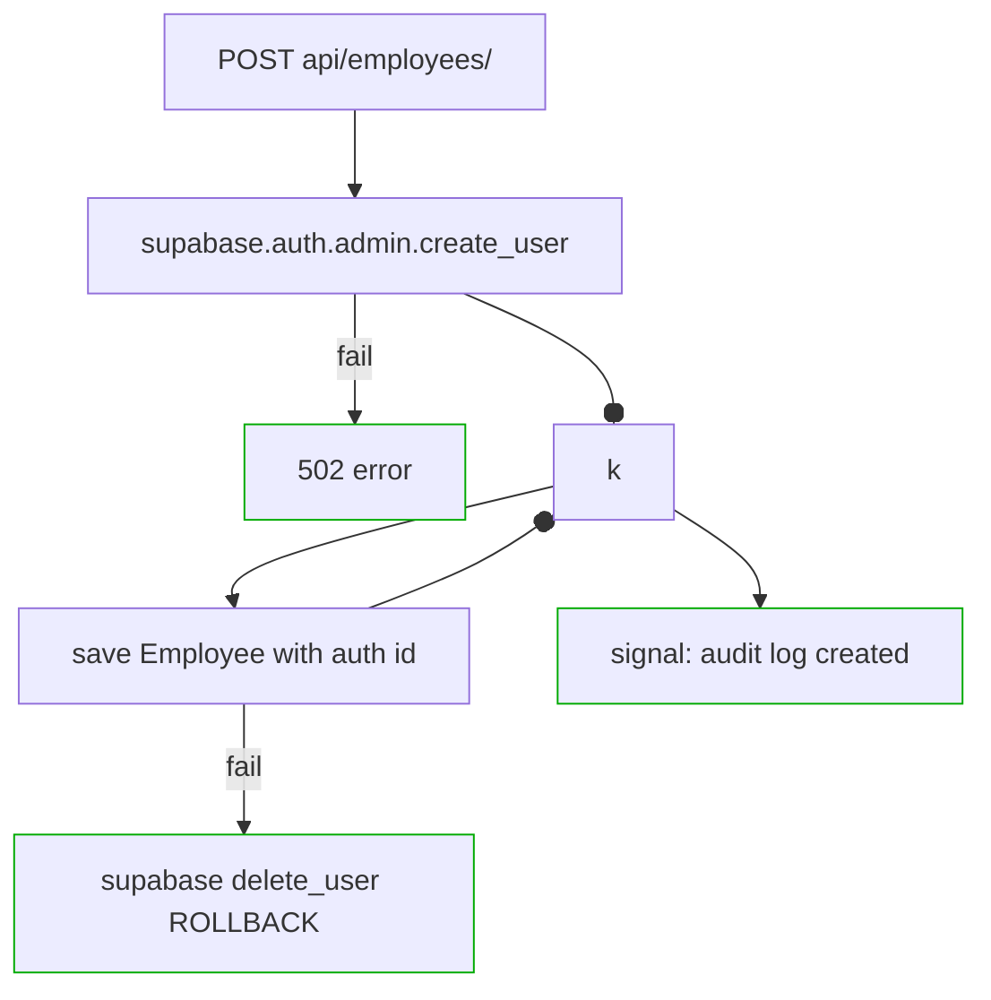
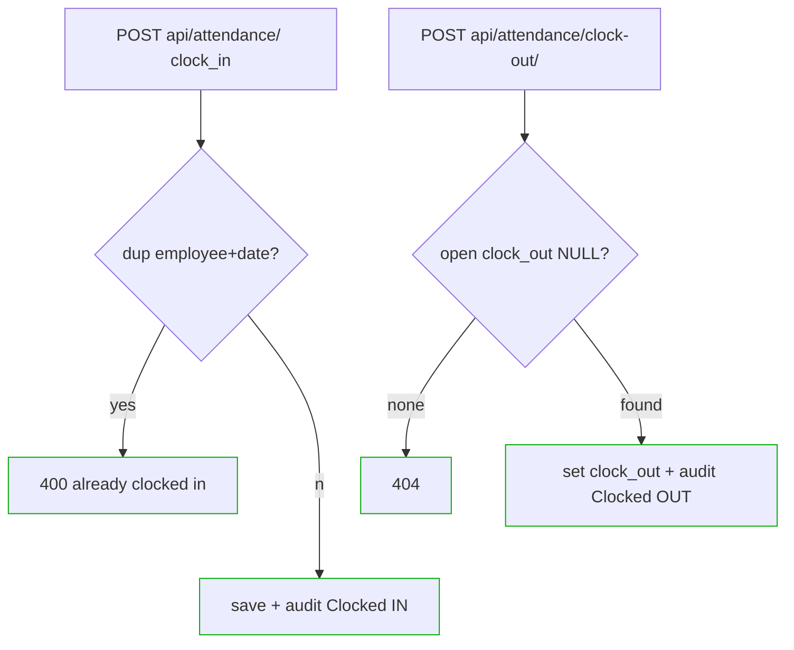
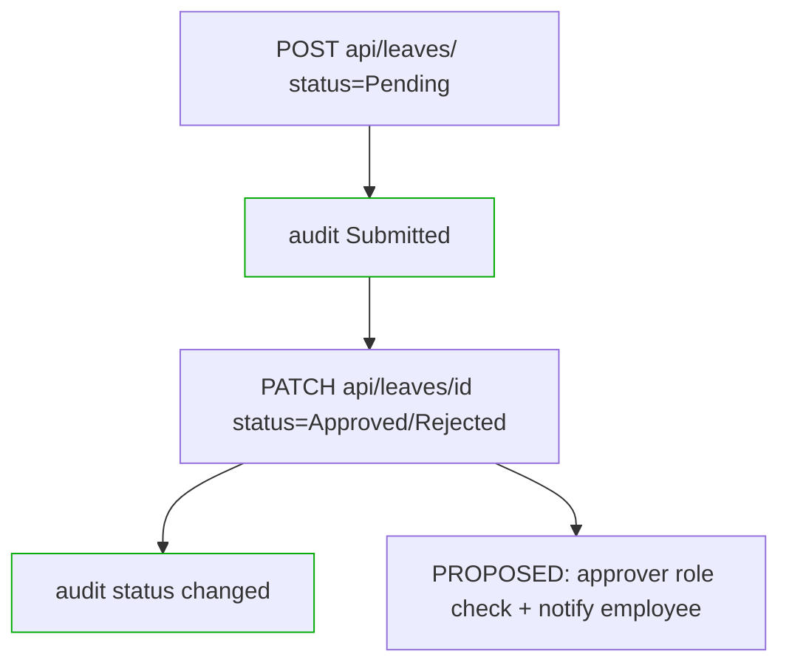
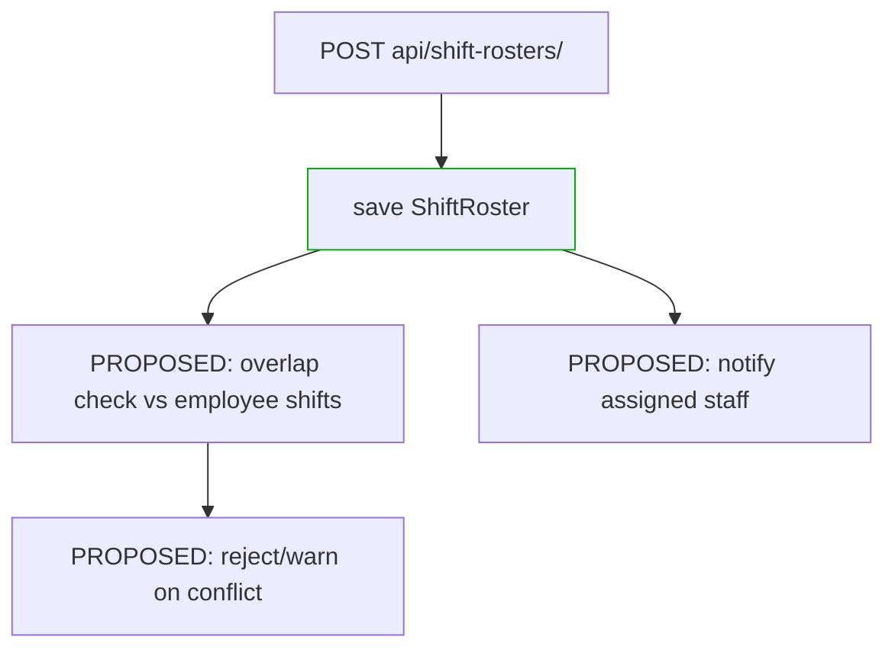
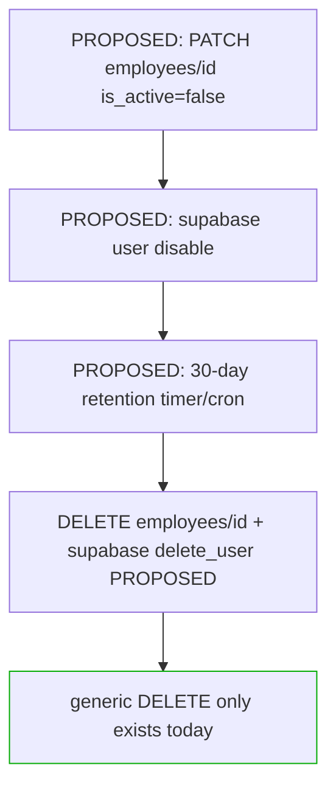

# Ch3 aide notes — KUMON-EMS (branch chore/standard-format, ab8737d; DB sqlite3; auth via Supabase cloud)
Source of truth: core/models.py (9 models), core/views.py (17 views), api/urls.py (15 routes), core/signals.py (audit), core/supabase_client.py, requirements.txt, settings.py.

## 1. SOP-to-code traceability
| SOP | Code (model / view / endpoint) | Status |
|---|---|---|
| SOP1 centralized data | Department+Employee CRUD: DepartmentListCreate/Detail, EmployeeListCreate/Detail; `GET api/dashboard-summary/` (DashboardSummaryView counts) | IMPLEMENTED (no RBAC — no permission_classes anywhere) |
| SOP2 attendance+payroll verification | Attendance/AttendanceDetail + AttendanceClockOutView (`POST attendance/clock-out/`); PayrollRun/Item CRUD; AttendanceSerializer dup-check; signals log clock-in/out | PARTIAL — CRUD only; GAP: no attendance→payroll computation/verification logic |
| SOP3 shifts+conflicts+notifications | ShiftRoster CRUD only (ShiftRosterListCreate/Detail, `shift-rosters/`) | GAP: no conflict check (ShiftRoster has NO employee FK), no notification code (MAILERS=console backend only) |
| SOP4 security/privacy | EmployeeListCreate.post: `supabase.auth.admin.create_user` + rollback `delete_user` on DB fail; EmployeeAuditLog (List only, via signals) | PARTIAL; GAP: no auth enforcement, no retention/consent logic |
| SOP5 resignation+30-day deletion | — (generic `DELETE employees/<uuid>/` exists, no resign flow) | GAP: no is_active offboarding, no Supabase user delete on resign, no purge job/cron |

## 2. Minimum HW/SW (justified from requirements.txt + settings.py)
reqs: Django==6.1, djangorestframework==3.18.0, django-cors-headers==4.9.0, supabase==2.31.0, python-dotenv==1.2.3. DB=sqlite3 (no server). Auth=Supabase cloud (needs internet + .env keys).
### Dev (build/test)
| Item | Min | Why |
|---|---|---|
| OS | Win10/Linux/macOS 64-bit | Django 6.1 supported platforms |
| CPU/RAM/Disk | 2-core, 4GB RAM, 1GB free | runserver+sqlite+test suite; no container/ML load |
| Python / pip | 3.11+ (repo runs 3.11.16) | Django 6.1 requires ≥3.10; supabase-py needs 3.8+ |
| Network | internet | pip install + Supabase Auth API + CORS to :3000/:8000 |
| Env | `.env`: SUPABASE_URL, SUPABASE_SERVICE_ROLE_KEY, SECRET_KEY | supabase_client.py raises ValueError without them |
### User (deploy/use)
| Item | Min | Why |
|---|---|---|
| Browser | Chrome/Edge/Firefox current | Django templates + DRF browsable API, no frontend build |
| Network | 1 Mbps + access to host + Supabase | all auth calls are cloud round-trips |
| Server | 1 vCPU/1GB RAM, sqlite file persist | actual settings.py backend; concurrent-write load not handled |
| SW | no install (web only) | server-side rendering + REST; CORS allows :3000/:8000 origins |

## 3. Mermaid flowcharts (PROPOSED = not in code)
### F1 onboarding (Supabase rollback implemented)

### F2 attendance clock-in/out (implemented)

### F3 leave filing/approval

### F4 shift scheduling + conflict check

### F5 resignation + 30-day deletion

## 4. Entity-field inventory (for ERD)
| Entity | Fields (PK=UUID id) | FK / constraint |
|---|---|---|
| Department | id, name UNIQUE, code UNIQUE null, manager FK, created_at, updated_at | manager→Employee SET_NULL |
| Employee | id, first_name, last_name, email UNIQUE, role null, department FK, date_hired auto, is_active=true | department→Department SET_NULL |
| Attendance | id, employee FK, date, clock_in null, clock_out null | employee→Employee CASCADE; UNIQUE(employee,date) |
| LeaveRequest | id, employee FK, leave_type=Personal, start_date, end_date, reason, status=Pending, created_at | employee→Employee CASCADE |
| ShiftRoster | id, name null, shift_type=General, start_time, end_time, break_mins=0, created_at, updated_at | NO employee FK (ERD: standalone; conflict join impossible) |
| PayrollRun | id, pay_period_start, pay_period_end, is_processed=false | — (header) |
| PayrollItem | id, payroll_run FK, employee FK, base_pay dec10,2, deductions, net_pay | run/item→CASCADE (no auto net=base-deduct) |
| PerformanceReview | id, employee FK, review_date, score int, comments | employee→Employee CASCADE |
| EmployeeAuditLog | id, employee FK null, action, timestamp auto | employee→Employee SET_NULL; read-only List endpoint |

## 5. GAP list (SOP steps with no code)
- G1 conflict detection: no query, no employee FK on ShiftRoster (signals use hasattr guard → always None).
- G2 notifications: zero notify/mail sends; settings MAILERS=console only.
- G3 payroll verification: PayrollItem.net_pay manual input; nothing derives pay from Attendance.
- G4 access control: no authentication/permission classes on any view; login/signup/auth all render login.html.
- G5 resignation purge: no is_active workflow, no Supabase delete on resign, no scheduled 30-day deletion.
